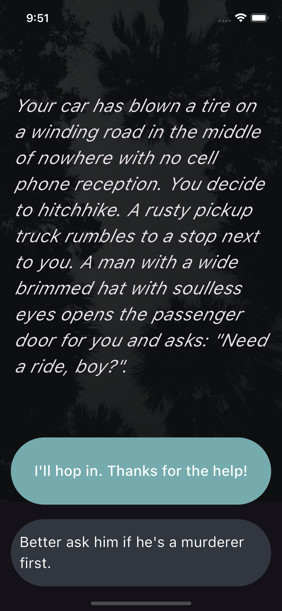

# Destini

Destini is a Flutter-based storytelling app that allows users to make choices that affect the story's outcome. It's inspired by the classic "choose your own adventure" books.

## Features

- Interactive storytelling with multiple story paths
- Clean and simple UI
- Uses Flutter's stateful widgets to manage story progression
- Visibility widget to manage UI components dynamically

## Screenshots

